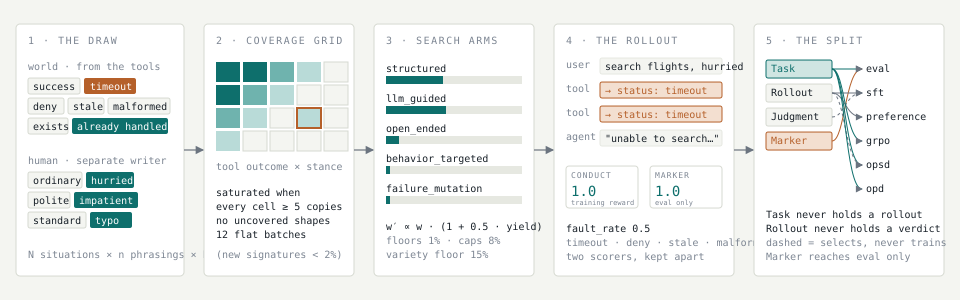

# zeroproof

The ZeroProof Python SDK. One package, two importable modules:

- `zeroproof`: the platform client. OTLP trace ingest and trace-dataset listing against the token gate.
- `zeroproof.simulations`: post-training data for an agent. (Was the separate top-level package `zeroproof_simulations`; that name still imports for two releases with a deprecation warning.) Give it the agent's traces, or its tools and system prompt; it simulates the situations, the people, and the world, plays the agent through multi-turn tool-calling conversations, and returns rows for your grader.

This repo absorbed the `zeroproof-simulations` package; `zeroproof-simulations` on PyPI is deprecated in favor of `zeroproof`.

Releases of `zeroproof` before 0.3 were an unrelated encrypted agent-to-agent messaging client. That code was removed in 0.04; pin `zeroproof<0.3` if you still depend on it.

Two ways in, one engine. Give it the agent's tools and system prompt and it samples situations across everything that agent can be asked. Give it graded traces as well and it aims the budget at the situations that fail in production, so new rows land where the agent is weak and carry both the failure and the fixed version. Every row is a full conversation: user turns, agent turns, tool calls, tool results, scheduled faults. Rows come back ungraded; your grader decides what good means. Default `explore`: one unique situation per row. How it thinks: [docs/simulations.md](docs/simulations.md).

## How a row gets made



A situation is drawn across the world axes (from the agent's tools) and the human axes (from a separate writer). It fills a cell in the coverage grid, nudges the five search arms, and the agent plays it against a world that breaks on schedule. The row that comes out splits into `Task`, `Rollout`, `Judgment`, and `Marker`, and every training target is a projection of some of those four. The interactive version, running on real rows, is at [zeroproofai.com/docs/engine](https://zeroproofai.com/docs/engine).

## Overview

`simulate()` is a pipeline.

1. **Read the agent.** Tools and system prompt. That is the spec of the world.
2. **Build a fake world from those tools.** Objects, plausible results, and faults (timeout, deny, junk).
3. **Write users.** A separate writer (same hosted model, different prompt, no agent policy) samples situations across tools, stance, history, and so on.
4. **Pick the diverse ones.** Embeddings plus a bit of noise so the batch is not 200 copies of the same prompt.
5. **Play the agent.** It talks, calls tools, gets results, talks again. All of that is stored: user text, agent text, tool calls, tool results, `final_text`.
6. **Grade.** Rows come back ungraded. Grade after with `zps.grade(...)`, pass your own `grader=`, or `grade=True` for the deterministic conduct score.

Stop when the row cap or the clock hits.

## How to use

```bash
pip install zeroproof   # or: uv add zeroproof
```

Bring your own model. Any OpenAI-compatible chat endpoint that returns tool
calls works; it writes the situations and plays the agent, so both run on
your key:

```bash
export OPENAI_API_KEY=...
export OPENAI_BASE_URL=...   # only for a non-OpenAI endpoint
```

```python
import zeroproof.simulations as zps

data = zps.simulate(agent="openai:gpt-4.1-mini", tools=my_tools,
                    system_prompt=my_system_prompt, output="rollout.jsonl")
```

Or use ZeroProof-hosted Qwen, which is the default when no `agent=` is given.
Ask us for a `VLLM_API_KEY`; the endpoint is shared and rate limited.

```bash
export VLLM_API_KEY=...
```

No key at all: the situation writer also defaults to hosted Qwen, even when
`agent=` is your own function. Pass `simulator=False` to use the built-in
template writer instead. It needs no model and runs in seconds; the
situations are less varied than a model writes, so it is for wiring up your
agent and grader, not for a training set.

```python
data = zps.simulate(my_agent, tools=my_tools, system_prompt=my_system_prompt,
                    simulator=False, budget=40)
```

Working in this repo: `uv sync`, then `uv run pytest` after `uv sync --extra dev`.

One runtime dependency (`requests`), Python 3.10+. Installing from PyPI rather than a
path or a git URL matters if you build a Prime Intellect environment on this:
the Environments Hub installs a pushed env with plain pip, so a `[tool.uv.sources]`
git pin resolves locally and then fails on their runtime with a
`ModuleNotFoundError`.

```python
import zeroproof.simulations as zps

data = zps.simulate(tools=my_tools, system_prompt=my_system_prompt, output="rollout.jsonl")
data = zps.simulate(agent=my_agent)
```

Pass `spec=` if you have a local tools-and-system-prompt folder. The generated datasets are on [Hugging Face](https://huggingface.co/datasets/zero-proof-ai/agent-simulations), organized by agent type instead of stored in this repo.

| Knob | Default | |
|---|---|---|
| `agent` / `spec` | hosted Qwen | Callable, URL, or tools + system prompt |
| `budget` / `time_budget` | `1000` / `None` | Stop when either hits. The clock is off unless you set it; `0` or `None` keeps it off |
| `requests_per_situation` | from mode | Phrasings: ways to ask one situation. Alias `phrasings=` |
| `rollouts_per_request` | from mode | Repeats: reruns of one phrasing. Alias `repeats=` |
| `fault_rate` | `0.5` | Broken tools. `0` off. Applied by the mock world, so a callable `agent=` that answers its own tool calls never sees one |
| `simulator` | hosted Qwen | Situation writer. `False` uses the built-in template writer (no model, less variety); an `openai:`/`vllm:` spec runs it on your endpoint |
| `reproducible` | `False` | Same seed, same concurrency, same agent: same rows. Runs batch by batch, so uneven latency costs throughput. Needs the clock off |
| `grade` | `False` | Rows come back ungraded; grade after with `zps.grade(...)`, or pass `grader=` (your callable) or `grade=True` (conduct score) |
| `llm_grade` | `False` | Extra LLM judge. Needs `OPENAI_API_KEY` |
| `output` | | JSONL path |

## What to run

Depends on the use case. How each scenario is built is in [The recipe](#the-recipe).

| You want | Mode | What happens |
|---|---|---|
| Many distinct situations | `explore` (default) | New situation every row |
| Same situation, different wording | `sft` | Multiple phrasings: tone, intent, personality |
| Same request, different agent behavior | `rl` | Multiple repeats of one phrasing |
| A mix, until coverage plateaus | `adaptive` | New situations, phrasings, and repeats. Best with `until="saturation"` |

```python
zps.simulate(tools=my_tools, system_prompt=my_system_prompt)                 # explore
zps.simulate(tools=my_tools, system_prompt=my_system_prompt, mode="sft")
zps.simulate(tools=my_tools, system_prompt=my_system_prompt, mode="rl")
zps.simulate(tools=my_tools, system_prompt=my_system_prompt, mode="adaptive", until="saturation")
```

## Examples

| Example | What it does |
|---|---|
| [`examples/agent-behavior`](examples/agent-behavior) | Start here if the platform is new to you. Runs a coding agent with bad habits against real tests, streams every turn to Zero Proof as OTLP spans plus a judge verdict, and fills a dashboard with behaviour worth looking at. No dependencies. |
| [`examples/prime-intellect-rl`](examples/prime-intellect-rl) | Generates a GRPO-ready dataset with `simulate(mode="rl")` and checks it carries gradient before you spend GPU time on it. |
| [`examples/schema`](examples/schema) | One row file in, six training targets out: eval, SFT, preference, GRPO prompts, OPSD hints, OPD. Migrates any legacy file first. Offline, no key. |
| [`examples/identity`](examples/identity) | Builds a leak-free SFT set that teaches a model a new name and maker, with Modal scripts to train a LoRA and evaluate it. No model calls to generate. |

## Store datasets on Zero Proof Labs

Push a run to your Zero Proof Labs account so the optimization framework
can iterate on it. For runtime SDK access, prefer a short-lived delegated
credential (`zp_dc_...`) issued from a valid Clerk session token. The SDK
uses `ZEROPROOF_DELEGATED_CREDENTIAL` by default; the legacy
`ZEROPROOF_API_KEY` still works for compatibility.

```python
# Preferred runtime path
# export ZEROPROOF_DELEGATED_CREDENTIAL="zp_dc_..."

# If you need to mint one from a Clerk session token:
# credential = zps.issue_delegated_credential(clerk_token, ttl_seconds=3600)
# export ZEROPROOF_DELEGATED_CREDENTIAL=credential["credential"]

data = zps.simulate(spec="specs/github")
v1 = data.push("github-explore-v1")            # -> {"datasetId": "ds_...", ...}

# iterate, then push the next version with lineage
v2 = data.push("github-explore-v2", parent=v1["datasetId"])

zps.datasets()                                  # list yours + storage used
rows = zps.pull(v1["datasetId"])               # rows, or pass path= for a file
zps.push_file("rollout.jsonl")                 # upload an existing JSONL
zps.delete_dataset(v1["datasetId"])            # permanent
```

Storage is private per account, 5 GB free. `parent=` records dataset
lineage so iterations show as a family on the platform.

## Speed

Two-minute airline runs using ZeroProof-hosted Qwen. Results were measured on the
hosted GPU with warm replicas and burst under load.

| Mode | Rows | Rate | Unique openers |
|---|---|---|---|
| `explore` | 240 | 120/min | 240 |
| `sft` | 278 | 139/min | 278 |
| `rl` | 625 | 296/min | 209 |

## Parameter reference

| Parameter | Default | Meaning |
|---|---|---|
| `agent` | hosted Qwen | Rollout model |
| `spec` | | Local tools and system prompt path |
| `tools`, `system_prompt` | from spec or agent | Tool list and agent system prompt |
| `situations` | | Distinct situations (N) |
| `requests_per_situation` | from mode | Phrasings per situation (n). Alias `phrasings=` / `n=` |
| `rollouts_per_request` | from mode | Repeats per phrasing (k). Alias `repeats=` |
| `unique_situations` | on in `explore` | Unique situations only |
| `mode` | `"explore"` | `explore`, `sft`, `rl`, `adaptive` |
| `reproducible` | `False` | Round-synchronous scheduling; see the knob table |
| `budget` | `1000` | Row cap |
| `time_budget` | `None` | Seconds. Off by default; `None` or `0` disables |
| `until` | `"compute"` | `"saturation"` also stops when coverage plateaus |
| `grade` | `False` | Grade after, or pass `grader=` / `grade=True` |
| `llm_grade` | `False` | Extra LLM judge |
| `output` | | JSONL path |
| `advanced` | | Keys below |

| `advanced` key | Default | |
|---|---|---|
| `concurrency` | `32` | Parallel rollouts |
| `stop_grace` | `5` | Seconds to wait for running rollouts and writer waves after a stop; queued ones are cancelled, still-running ones are reported as `rollouts_abandoned` / `writer_waves_abandoned` |
| `embedder` | `"hash"` | Prompt selection |
| `seed` | `0` | Reproducible draws. Bit-for-bit at `concurrency: 1` or with `reproducible=True`; otherwise which rows land before the cap depends on thread timing |
| `avg_turns` | `4` | Target conversation length |

Aliases: `phrasings=` / `n=` → `requests_per_situation`; `repeats=` → `rollouts_per_request`; `unique=` → `unique_situations`; `policy=` → `system_prompt`; `risk=` → `fault_rate`.

## Output

Each row, in `data.trajectories` and on disk: `prompt`, `messages`, `steps`, `final_text`, `scenario_id`. Optional `world_state`, `faults`, `reward`, `reason`. `llm_grade=True` adds `llm_reward`. `zps.rank(path)` adds `quality` without changing `reward`.

Every row carries `schema_version` (`"1"`). A row is a projection of four objects in `zeroproof.simulations.schema`: `Task` (the situation), `Rollout` (one episode), `Judgment` (a scorer's verdict), `Marker` (a behavior measurement). `zps.from_row(row)` splits a row into them and `zps.to_row(...)` flattens them back. The wire contract is `zeroproof/simulations/schemas/row-v1.json`. Rows written before the stamp are version 0 and load by shape, so older files still work.

## The recipe

Each scenario is a draw across the world and the human.

**World** (from this agent's tools and system prompt)

- objects and tool results that match the spec
- tool outcome: success, timeout, deny, stale, etc.
- world state: exists, missing, already handled, unfinished, etc.
- history: first visit, prior miss, return, etc.
- rules the agent is supposed to follow

**Human**

- intent: which tool, what they want (randomized sometimes)
- stance: ordinary, ambiguous, adversarial, hurried, etc.
- persona: first time, returning, in a hurry, etc.
- tone: impatient, frustrated, polite, etc.
- typing: standard, lowercase, typo, clipped, etc.

Ordinary asks first, then the edges. On top of that, we embed the openers and add a bit of random noise so the batch stays spread out, not a cluster of near-copies. Spend the row cap and the clock on diversity, not copies.

## Package layout

The public surface is the package itself: `import zeroproof.simulations as zps`.
Internals are grouped by stage and may move between releases.

| folder | what lives there |
|---|---|
| `generate/` | situation grid, writer, diversity selection, agent runners and adapters |
| `score/` | conduct checks, judges, quality ranking, selection for SFT and RL |
| `ingest/` | trace loading, OpenTelemetry rows, platform push and pull |
| `world/` | the mock tool environment |
| `run/` | the engine behind `simulate()`: knob resolution (`config.py`), spec loading (`spec.py`), row helpers (`rows.py`), and the scheduler itself (`engine.py`: inputs, build, loop, finish) |
| `simulation.py`, `data.py`, `export.py` | the `simulate()` entry point, its result object, and training export |

## License

Apache-2.0
