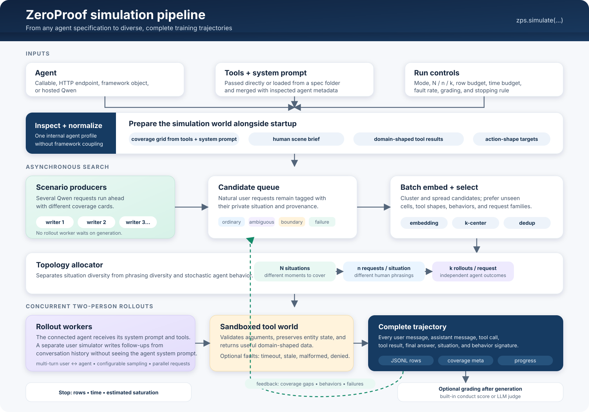

# ZeroProof simulation pipeline

The three counts stay independent:

- **N situations**: different worlds the agent may face
- **n phrasings** (`requests_per_situation`, alias `phrasings=`): different human wordings of one world
- **k repeats** (`rollouts_per_request`, alias `repeats=`): independent agent runs from the same phrasing

Search is diversity-first over tools and stances. It spends the row cap (`budget`) and the clock (`time_budget`) on new coverage, then stops. The sandbox can inject tool faults (timeout, deny, junk results).

Scenario generation runs ahead of rollout execution. Rollout workers consume selected requests and never synchronously generate their own scenarios. The connected agent and simulated user are separate roles with separate prompts; the user simulator does not receive the agent's system prompt. Grading is optional and runs after trajectory generation.
